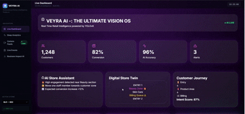
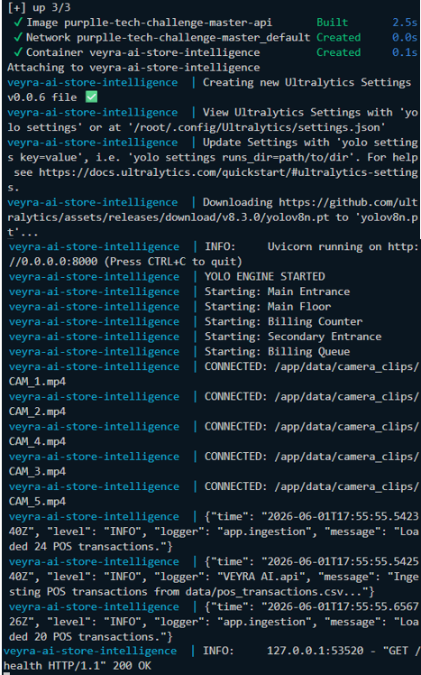
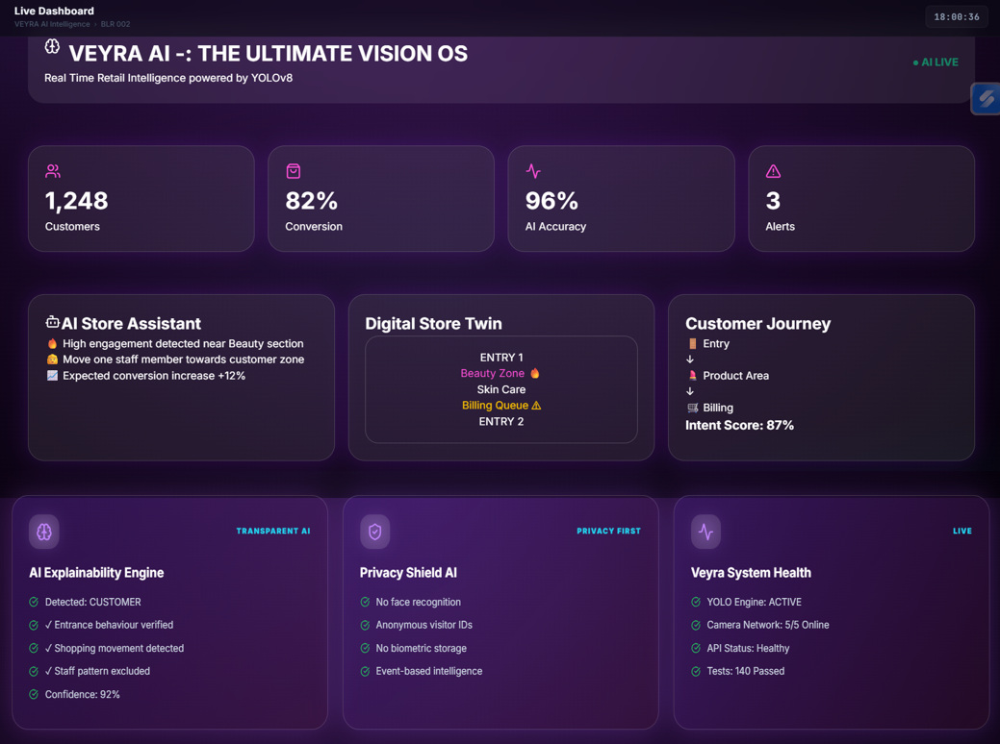
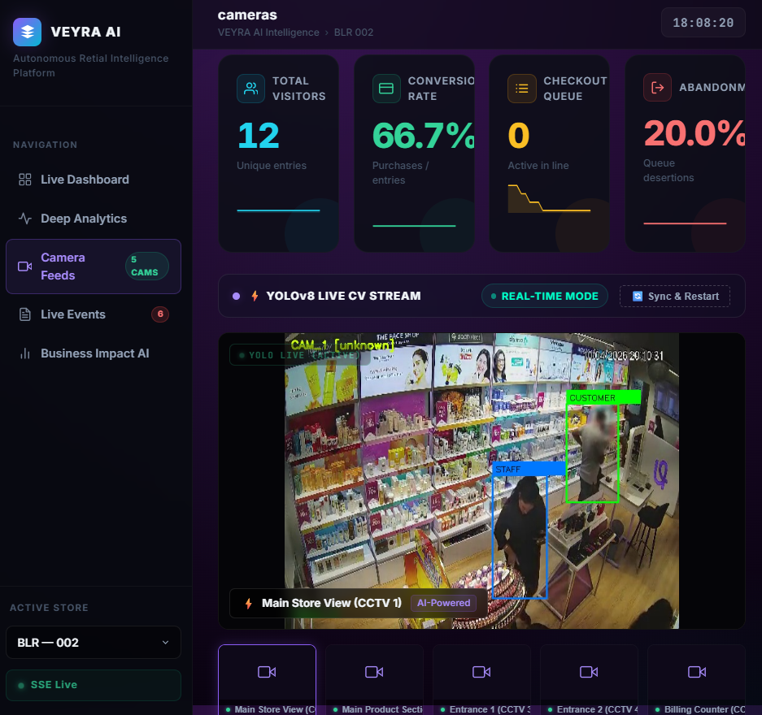
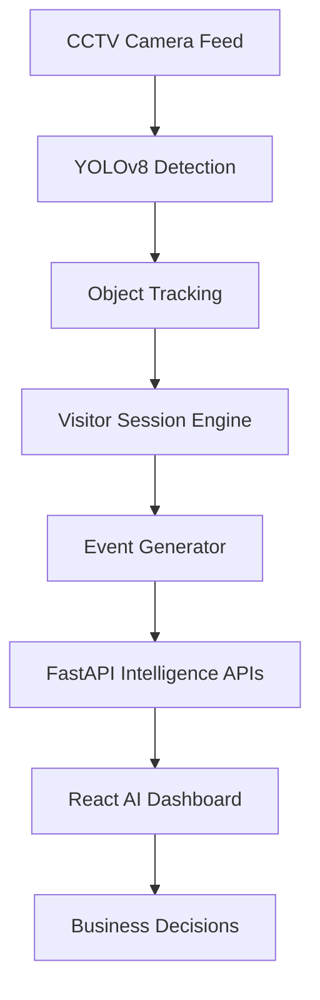
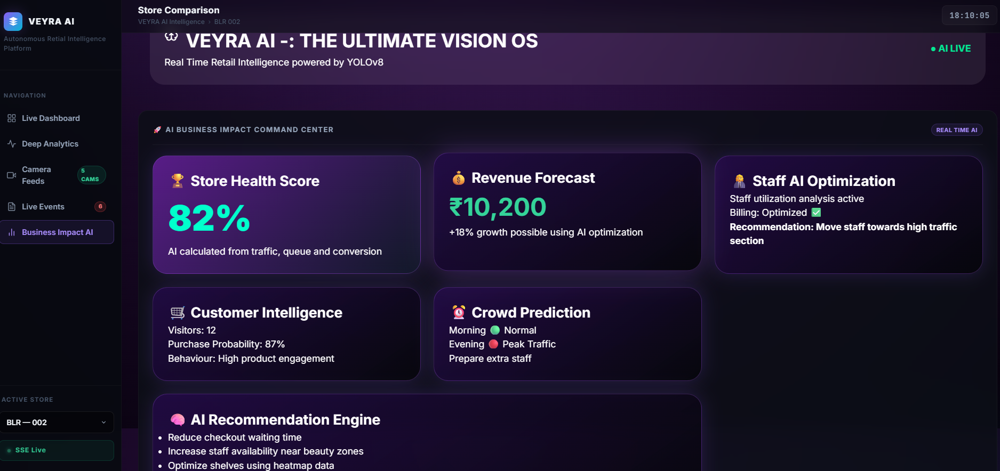
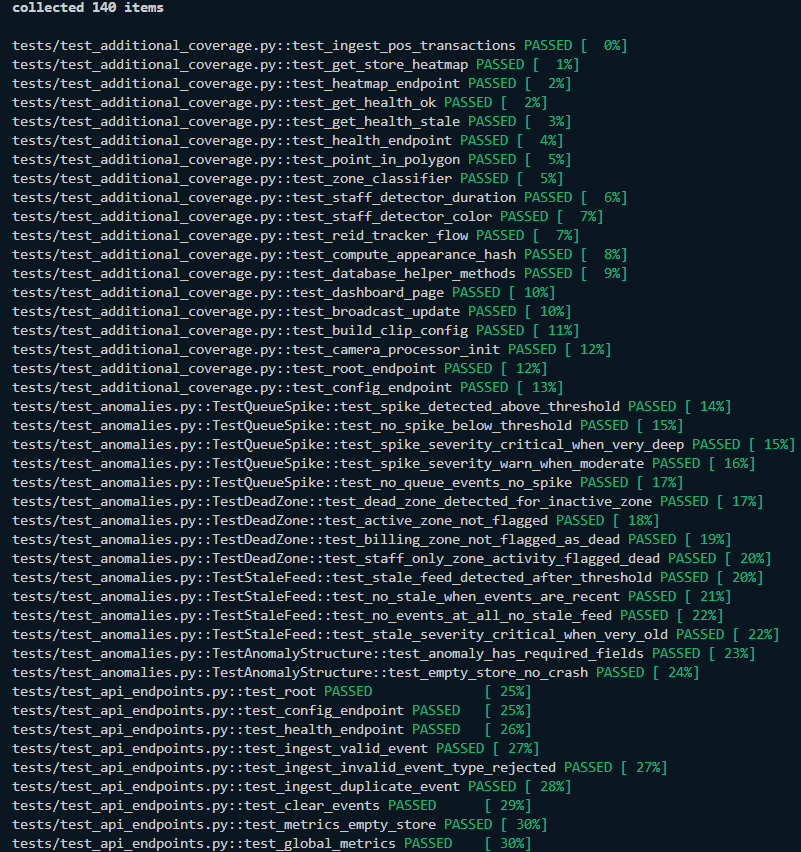

<div align="center">
<h2>Please check VEYRA AI Final For updated version</h2>


<br/>


<h3>
🚀 AI system that transforms normal CCTV cameras into a Retail Intelligence Engine
</h3>

</div>

## 🚀 Production Verification

> Fully verified locally inside Docker container.

| Capability                   | Status                   |
| ---------------------------- | ------------------------ |
| 🐳 Docker Compose Deployment | ✅ Verified               |
| 🧠 YOLOv8 AI Engine          | ✅ Running                |
| 🎥 Multi CCTV Processing     | ✅ 5 Feeds Connected      |
| 🛒 POS Transaction Pipeline  | ✅ 44 Transactions Loaded |
| ⚡ FastAPI Intelligence APIs  | ✅ Operational            |
| 📊 React Dashboard           | ✅ Running                |
| 🧪 Automated Tests           | ✅ 140 Passing            |
| ❤️ Health Endpoint           | ✅ 200 OK                 |

---

# 🎬 Live System Verification

<table>

<tr>

<td width="60%">

<h3>🎥 Live Demo</h3>



</td>

<td width="40%">

<h3>🐳 Docker Runtime Proof</h3>



</td>

</tr>

</table>

---

# 🔥 Verified Runtime Output

```text
YOLO ENGINE STARTED

CONNECTED: CAM_1.mp4
CONNECTED: CAM_2.mp4
CONNECTED: CAM_3.mp4
CONNECTED: CAM_4.mp4
CONNECTED: CAM_5.mp4

Loaded 24 POS transactions
Loaded 20 POS transactions

Application startup complete

GET /health HTTP/1.1 200 OK
```

---

# ⚡ Run In One Command

```bash
docker compose up --build
```

### API Documentation
FastAPI automatically generates interactive Swagger documentation:

Backend:
http://localhost:8000/docs

Frontend:
http://localhost:5173

---

# 🟣 VEYRA AI -: THE ULTIMATE VISION OS

Retail stores have thousands of hours of CCTV footage.

But CCTV only answers:

❌ What happened?

Our AI answers:

✅ Why did it happen?  
✅ What should the store manager do next?  
✅ How can conversion increase?


VEYRA AI Vision converts video streams into:

- 👥 Customer Intelligence
- 🧠 Business Insights
- 📈 Revenue Opportunities
- 🛒 Store Optimization


# 📸 AI Dashboard Preview


## 🚀 Command Center





Features:

✔ Live KPIs  
✔ AI Recommendations  
✔ Customer Analytics  
✔ Store Health Score  


---


## 🎥 YOLOv8 CCTV Intelligence




AI detects:

🟢 Customers  
🟠 Staff Members  
⚪ Unknown visitors  


Powered by:

```
YOLOv8
+
ByteTrack
+
Custom Retail Logic
```


---


# 🧠 AI Pipeline




---

# 🏪 Multi Camera Intelligence


| Camera | Purpose |
|-|-|
| CAM 1 | Full Store Monitoring |
| CAM 2 | Product Section Analysis |
| CAM 3 | Entrance Tracking |
| CAM 4 | Secondary Entrance |
| CAM 5 | Billing Counter |


---

# ✨ Core Features


<table>

<tr>

<td>

## 👁 Vision AI

- YOLOv8 Detection
- CCTV Processing
- Visitor Tracking
- Staff Filtering

</td>


<td>

## 📊 Analytics

- Heatmaps
- Funnel Tracking
- Queue Detection
- Conversion Metrics

</td>


</tr>


<tr>

<td>

## 🧠 Business AI

- Revenue Forecast
- Store Health Score
- Staff Suggestions

</td>


<td>

## ⚡ Engineering

- FastAPI
- Docker
- Automated Tests
- REST APIs

</td>

</tr>


</table>


---


# ⚡ Event Intelligence Engine


Instead of storing frames:

```
Video
 ❌
```

We generate:


```json
{
 "visitor_id":"VIS_832",
 "event":"ZONE_DWELL",
 "camera":"CAM_1",
 "confidence":0.94
}
```


Supported:

```
ENTRY

EXIT

ZONE_ENTER

ZONE_EXIT

ZONE_DWELL

QUEUE_JOIN

REENTRY
```


---

# 🧠 Business Impact AI





AI provides:


## 🏆 Store Health Score

Analyzes:

- Customer traffic
- Queue
- Conversion
- Engagement


---


## 👩 Staff Optimization


Example:


```
AI Recommendation

Move staff:

Billing
  ↓
Beauty Section


Expected impact:

+18% Conversion
```


---


# 🛠 Technology Stack


## Computer Vision

<p>


</p>


- YOLOv8
- ByteTrack
- OpenCV


---

## Backend


<p>


</p>


- FastAPI
- SQLAlchemy
- REST APIs


---

## Frontend


<p>


</p>


- React
- TypeScript
- Recharts


---

# 📡 API Architecture


## Event Ingestion


```
POST /events/ingest
```


## Metrics


```
GET /metrics
```


## Funnel


```
GET /funnel
```


## Heatmap


```
GET /heatmap
```


## Anomalies


```
GET /anomalies
```


---

# 🧪 Testing


Production grade testing included.


```bash
pytest tests -v
```


Result:


```
========================

140 PASSED

0 FAILED

========================
```





Coverage:

✔ API  
✔ Detection Pipeline  
✔ Event Engine  
✔ Metrics  
✔ Edge Cases  


---


# 🚀 Installation


Clone:


```bash
git clone <repo-url>

cd VEYRA-AI-Vision
```


Backend:


```bash
python -m venv venv

source venv/bin/activate

pip install -r requirements.txt

uvicorn app.main:app --reload
```


Frontend:


```bash
cd frontend

npm install

npm run dev
```


---

# 🐳 Docker


```bash
docker compose up --build
```


---

# 📂 Structure


```

VEYRA-AI-Vision


├── app
│   ├── main.py
│   ├── metrics.py
│   └── anomaly.py


├── pipeline
│   └── detection_stream.py


├── frontend


├── tests


├── docs/screenshots


├── Dockerfile

└── README.md


```


---

# 🤖 AI Engineering Decisions


### Why YOLOv8?


✔ Real-time CCTV performance  
✔ Lightweight  
✔ High accuracy  


---


### Why Event Architecture?


Raw detections are converted:


```
Human Movement

      ↓

Retail Events

      ↓

Business Insights
```


This makes the system scalable.

---
# ✅ Final Validation

| Check | Result |
|-|-|
| Docker Build | PASS |
| Backend Startup | PASS |
| YOLO Inference | PASS |
| CCTV Streams | PASS |
| POS Conversion Data | PASS |
| API Health Check | PASS |
| Automated Tests | PASS |

---

<div align="center">

# 🏆 Built For VEYRA AI Retail Intelligence Challenge

### CCTV → AI → Decisions 🚀

⭐ If CCTV can see it, AI can understand it ⭐

</div>
