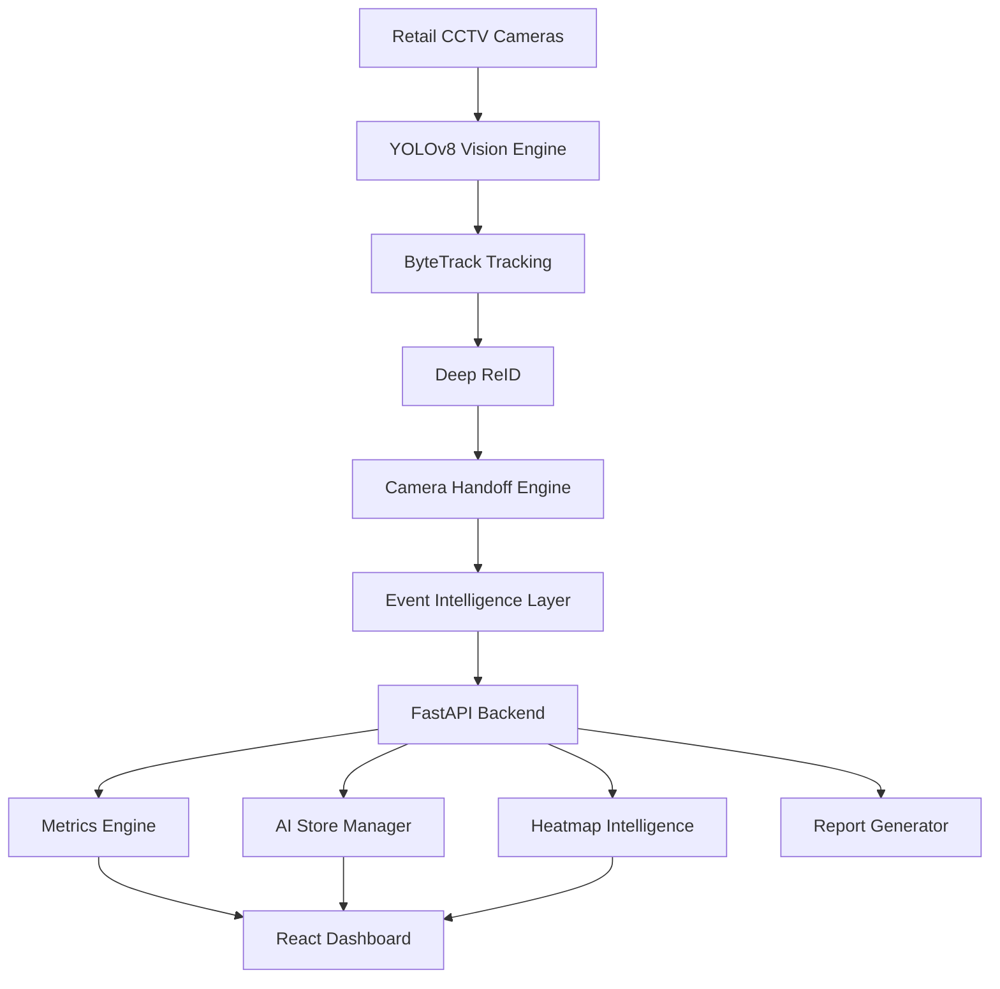

# 🏗 VEYRA AI Architecture


## Complete Pipeline





---


## Data Transformation


```
Video Frame

    |

Detection

    |

Person Identity

    |

Customer Behaviour

    |

Business Event

    |

AI Decision

```


---


## Scaling Design


Current:

```
8 Cameras
+
16K Events
```


Production:


```
1000 Stores

        |

Camera Streams

        |

AI Worker Cluster

        |

Event Queue

        |

Analytics Platform

```


---


# System Philosophy


```
Do not store videos.

Understand behaviours.

Generate decisions.
```
