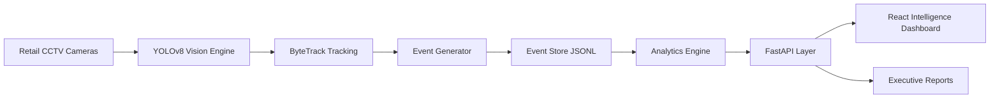

# 🏗️ VEYRA AI — System Design Document

<div align="center">

## 👁️ Vision Enabled Yield & Retail Analytics

### Transforming CCTV Streams into Real-Time Retail Intelligence

`Computer Vision` • `Event Driven Architecture` • `AI Analytics` • `Retail Intelligence`

</div>

---

# 1. 🎯 System Objective

VEYRA AI converts existing retail CCTV infrastructure into an intelligent analytics operating system.

Traditional CCTV:

```text
Camera
  ↓
Video Storage
  ↓
Manual Review
```

VEYRA AI:

```text
CCTV Stream
      ↓
AI Vision Engine
      ↓
Tracking Layer
      ↓
Event Intelligence
      ↓
Analytics API
      ↓
Business Decisions
```

The platform analyzes:

✅ Customer movement
✅ Zone engagement
✅ Conversion journey
✅ Queue behaviour
✅ Store performance
✅ Operational improvements

---

# 2. 🧠 High Level Architecture



Core principle:

> Store meaningful events instead of storing unnecessary video data.

---

# 3. 📹 Computer Vision Pipeline

## Detection Model: YOLOv8

YOLOv8 was selected for:

| Requirement               | Benefit                              |
| ------------------------- | ------------------------------------ |
| Real-time inference       | Low latency detection                |
| Retail CCTV compatibility | Reliable person detection            |
| Deployment                | Lightweight model variants           |
| Accuracy                  | Modern object detection architecture |

Pipeline:

```text
Video Frame

     ↓

Person Detection

     ↓

Bounding Box Extraction

     ↓

Object Tracking

     ↓

Retail Event Creation
```

---

# 4. 🧬 Tracking & Visitor Journey Design

Tracking uses ByteTrack for maintaining object consistency across frames.

Capabilities:

* Persistent visitor sessions
* Temporary occlusion handling
* Movement analysis
* Zone transitions

Example Journey:

```text
Visitor VIS_001

Entry Camera

      ↓

Product Zone

      ↓

Billing Counter
```

Result:

```json
{
 "visitor_id":"VIS_001",
 "journey_type":"Converted Customer",
 "camera_handoffs":2
}
```

---

# 5. 🔁 Re-entry & Duplicate Handling

Challenge:

A visitor may:

* Leave camera view
* Re-enter zones
* Appear multiple times

Solution:

VEYRA maintains visitor sessions using:

* Tracking IDs
* Timestamp windows
* Camera events
* Zone history

This prevents duplicate counting.

---

# 6. 👥 Staff Exclusion Strategy

Retail cameras capture:

* Customers
* Employees

Including staff creates incorrect analytics.

Filtering pipeline:

```text
Detected Person

      ↓

Movement Analysis

      ↓

Zone Behaviour

      ↓

Staff Flag Assignment

      ↓

Analytics Filtering
```

Events contain:

```json
{
 "visitor_id":"VIS_001",
 "is_staff":false
}
```

Staff events are excluded from customer analytics.

---

# 7. 📦 Event Driven Data Architecture

VEYRA stores intelligence events instead of raw frames.

Example JSONL event:

```json
{
 "event_id":"evt_001",
 "store_id":"ST1008",
 "visitor_id":"VIS_200",
 "camera_id":"s1c1",
 "event_type":"zone_entered",
 "timestamp":"2026-06-04T11:00:00Z",
 "dwell_ms":45000
}
```

Benefits:

✅ Lightweight storage
✅ Replayable analytics
✅ Easy debugging
✅ Production scalability

---

# 8. ⚡ Backend Architecture

Backend: FastAPI

Services:

```text
FastAPI Application

       |
       |
       +---- Event Store

       +---- Metrics Engine

       +---- Heatmap Engine

       +---- Journey Engine

       +---- AI Manager

       +---- Report Engine
```

API Layer:

* Store metrics
* Conversion funnel
* Heatmap intelligence
* AI recommendations
* Reports

---

# 9. 🔥 Retail Intelligence Engine

## Heatmap Analytics

Detects:

🔥 High engagement zones

🟡 Active areas

⚠️ Low performing zones

Example:

```json
{
 "zone":"Billing Counter",
 "status":"HOT",
 "recommendation":"Maintain staff availability"
}
```

---

# 10. 🤖 AI-Assisted Decisions

AI assistance was used during engineering for:

### Architecture Decisions

* Modular service separation
* Event driven design review
* API structure improvement

### Debugging Assistance

* Identifying data flow issues
* Improving error handling
* Optimizing development workflow

### Documentation Support

* Architecture explanation
* Design validation
* README preparation

All generated suggestions were:

✔ Reviewed manually
✔ Tested locally
✔ Modified before implementation

---

# 11. 🧪 Testing Strategy

Validated:

* API responses
* Event ingestion
* Analytics calculations
* Edge cases
* Health endpoints

Testing focus:

```text
Input Events

      ↓

Processing Logic

      ↓

Expected Analytics Output
```

---

# 12. 🚀 Production Readiness

Implemented:

✅ Docker support
✅ Modular backend
✅ API separation
✅ Event based processing
✅ JSONL export pipeline
✅ Error handling

Future scaling:

```text
Camera Streams

       ↓

AI Workers

       ↓

Event Queue

       ↓

Analytics Services

       ↓

Dashboard
```

---

# 13. 🔮 Future Enhancements

Planned:

* Kafka streaming
* Edge GPU deployment
* Advanced appearance based ReID
* Forecasting models
* Multi-region analytics

---

<div align="center">

# VEYRA AI 

## Camera → Vision → Events → Intelligence 🚀

</div>
