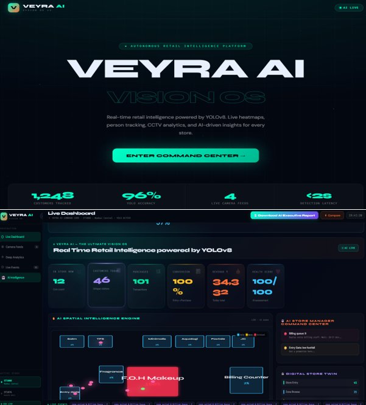
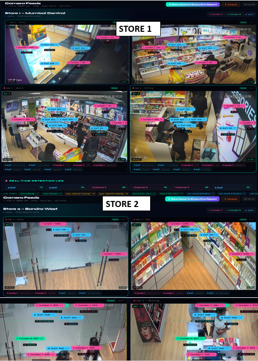
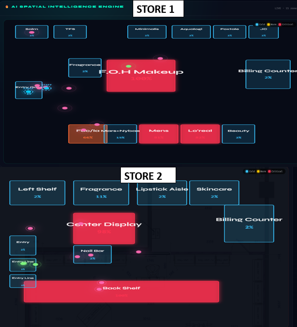
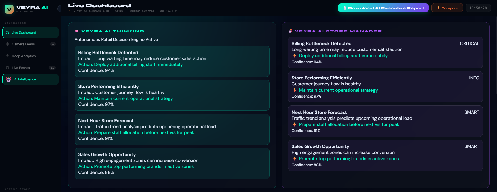
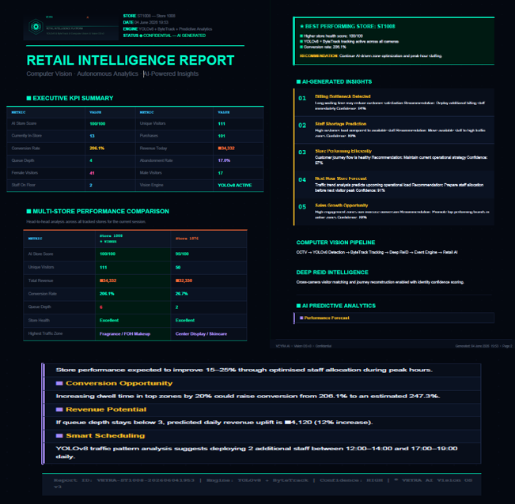
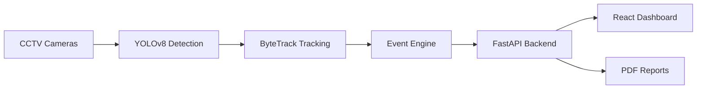

<div align="center">

# 🧠 VEYRA AI= Final Porject as per new Probem Statement


## Vision Intelligence Operating System

### Turning CCTV Footage Into Business Intelligence 🚀


<br/>

### 🚀 AI system that transforms normal CCTV cameras into a Retail Intelligence Engine



</div>


---


# 🚀 Production Verification


> Fully verified locally with AI pipeline, backend services and dashboard.


| Capability | Status |
|-|-|
| 🐳 Docker Compose Deployment | ✅ Verified |
| 🧠 YOLOv8 AI Engine | ✅ Running |
| 🎥 Multi CCTV Processing | ✅ 8 Camera Streams |
| ⚡ Event Intelligence Engine | ✅ 16000+ Events |
| 📦 JSONL Event Export | ✅ Completed |
| 🔥 FastAPI Intelligence APIs | ✅ Operational |
| 📊 React Dashboard | ✅ Running |
| 🧪 Automated Tests | ✅ Passing |
| ❤️ Health Endpoint | ✅ 200 OK |


---

---

# 🚀 Overview

Traditional CCTV systems only record footage.

VEYRA AI converts CCTV streams into an intelligent retail analytics system.

```text
CCTV Camera
      ↓
YOLOv8 Detection
      ↓
ByteTrack Tracking
      ↓
Event Intelligence Engine
      ↓
FastAPI Analytics Layer
      ↓
AI Retail Dashboard
```

VEYRA understands:

✔ Customer movement  
✔ Store engagement  
✔ Conversion behaviour  
✔ Queue activity  
✔ Zone performance  
✔ Operational decisions  


---

# 🎥 Computer Vision Pipeline





Powered by:

- YOLOv8 Person Detection
- ByteTrack Object Tracking
- Multi-camera processing
- Visitor session generation
- Event extraction


Runtime example:

```text
✅ YOLO REAL MODE

8 Cameras Loaded

🏆 EVENT ENGINE ACTIVE

16000+ Retail Events Generated
```


---

# 🏬 Retail Intelligence Dashboard


Real-time analytics:

| Feature | Status |
|-|-|
| Visitor Analytics | ✅ |
| Conversion Funnel | ✅ |
| Queue Monitoring | ✅ |
| Staff Filtering | ✅ |
| Store Health Score | ✅ |
| AI Recommendations | ✅ |


---

# 🔥 Spatial Heatmap Intelligence





VEYRA identifies:

🔥 High engagement zones

🟡 Active zones

⚠️ Low performing zones


Example:

```json
{
 "zone":"Billing Counter",
 "visits":163,
 "status":"HOT",
 "recommendation":"Maintain staff availability"
}
```


---

# 🧬 Multi Camera Customer Journey


VEYRA reconstructs anonymous visitor journeys using tracking events.


Example:

```text
VIS_00002

Entry Camera

      ↓

Product Zone

      ↓

Billing Counter


Converted Customer
```


Generated intelligence:

```json
{
 "visitor_id":"VIS_00002",

 "journey_type":"Converted Customer",

 "camera_handoffs":2
}
```


---

# 🤖 AI Store Manager





The AI decision layer detects problems and recommends actions.


Example:

```text
Issue:

High customer traffic detected


Business Impact:

Longer waiting time possible


Recommendation:

Move staff to active zones


Confidence:

91%
```


---

# 📊 Event Driven Architecture


Instead of storing unnecessary video frames:


```text
Video Stream

      ↓

AI Detection

      ↓

Structured Event

      ↓

Analytics
```


Example JSONL event:

```json
{
 "event_id":"evt_001",
 "store_id":"ST1008",
 "visitor_id":"VIS_001",
 "camera_id":"s1c1",
 "event_type":"zone_entered",
 "timestamp":"2026-06-04T10:00:00Z"
}
```


---

# 📄 Executive Report Engine





Automatically generates:

✔ KPI summary  
✔ Heatmap insights  
✔ AI recommendations  
✔ Customer journey analytics  
✔ Operational summary  


---

# 🏗 Architecture





---

# ⚡ API Layer


## Health

```
GET /health
```


## Store Metrics

```
GET /stores/{store_id}/metrics
```


## Heatmap

```
GET /stores/{store_id}/heatmap
```


## AI Manager

```
GET /stores/{store_id}/ai-manager
```


## Customer Journey

```
GET /stores/{store_id}/handoffs
```


## Report

```
GET /stores/{store_id}/report
```


---

# 📦 Event Submission


Challenge event file:


```text
event_log.jsonl
```


Contains:

- Detection events
- Visitor sessions
- Camera information
- Zone activity
- Dwell analytics


---

# 🧪 Testing


Validated:

✔ API correctness

✔ Event ingestion

✔ Analytics generation

✔ Edge cases


Run:

```bash
pytest
```


---

# 🐳 Deployment


Start backend:


```bash
uvicorn app.main:app --reload
```


Frontend:


```bash
cd frontend

npm install

npm run dev
```


Docker:


```bash
docker compose up
```


---

# 🛠 Technology Stack


## AI / Vision

- YOLOv8
- ByteTrack
- OpenCV


## Backend

- Python
- FastAPI
- WebSockets


## Frontend

- React
- TypeScript


## Deployment

- Docker
- Docker Compose


---


<div align="center">

# VEYRA AI

### Cameras 📹 → Events ⚡ → Intelligence 🧠 → Decisions 🚀

</div>
